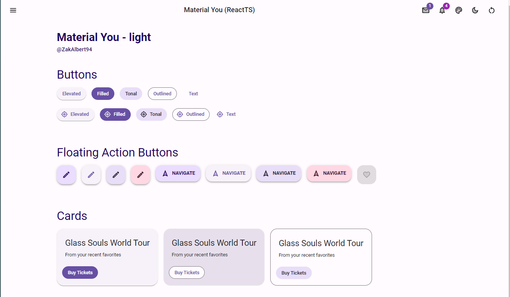
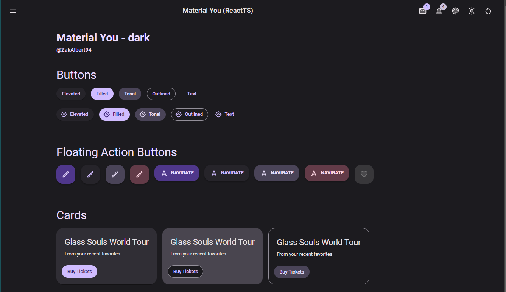
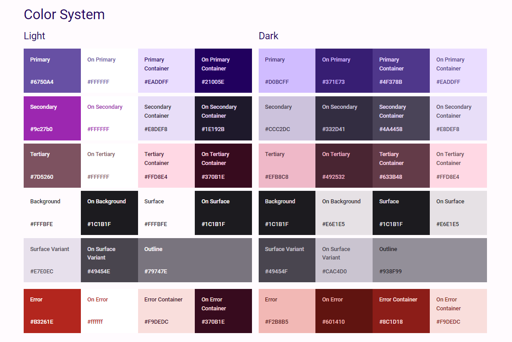
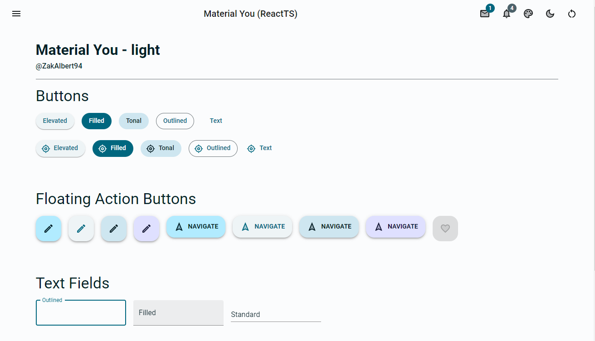
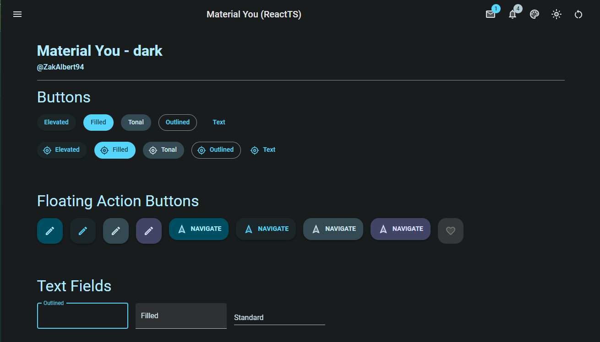
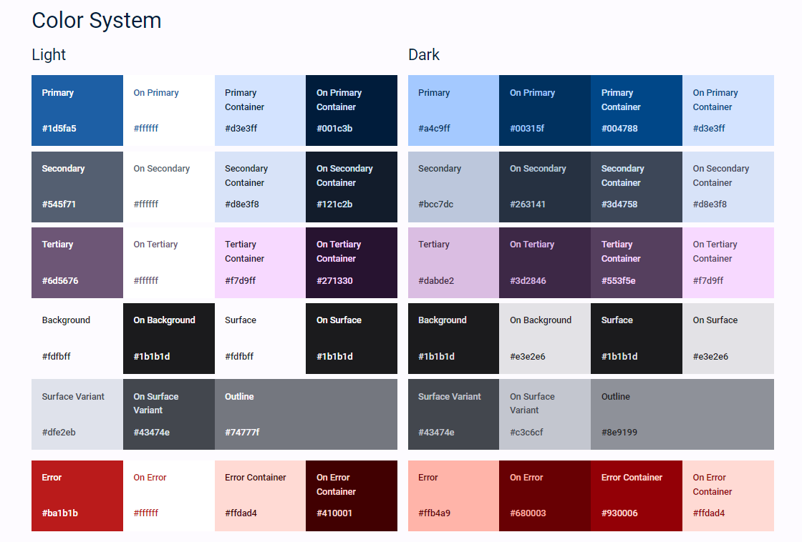

# MUI Material You
Aplicacion React y MUI aplicando el esquema de colores de Android Material You

## Default Light

## Default Dark

## Color System

## Tema y estilos generados dinamicamente en base al color azul
### Light

### Dark

## Color System

