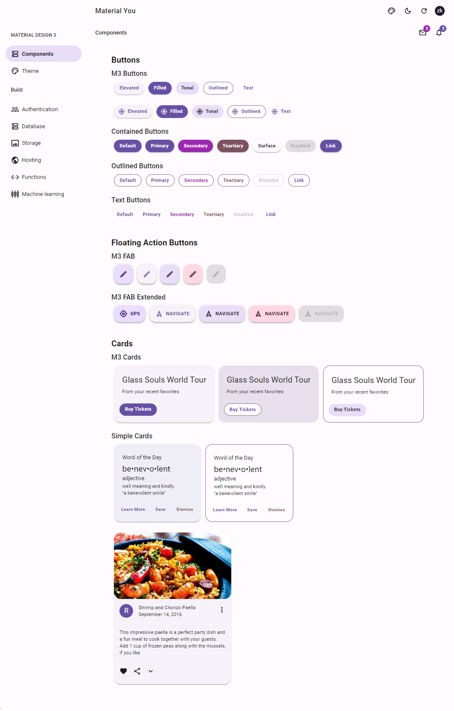
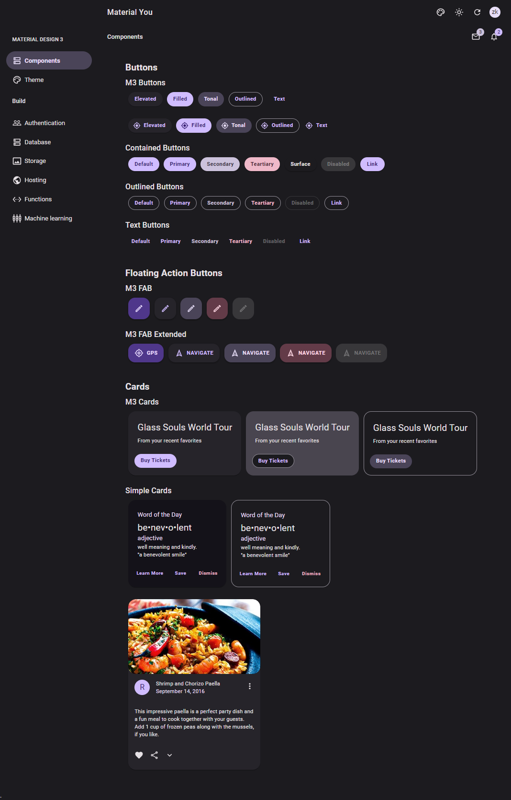
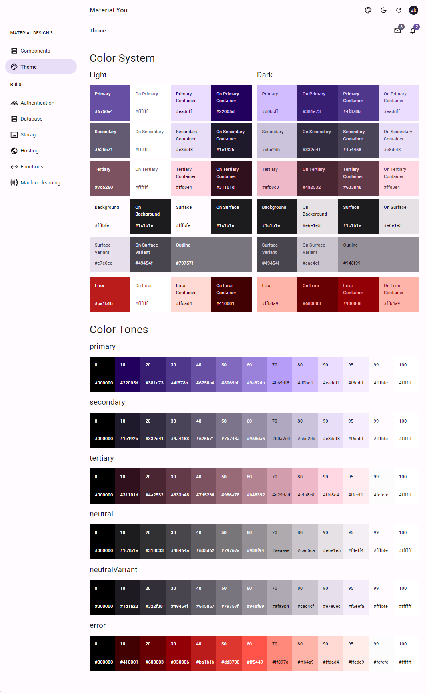
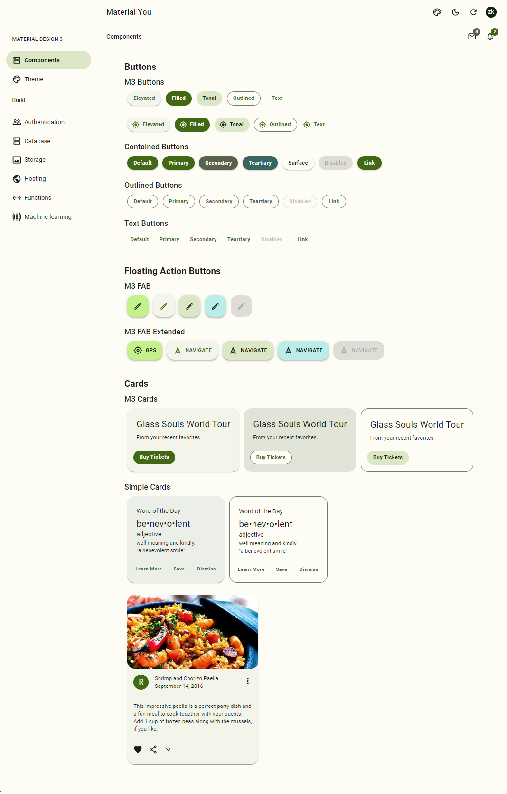
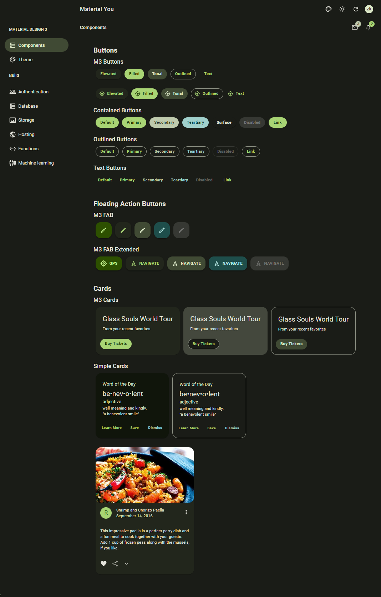
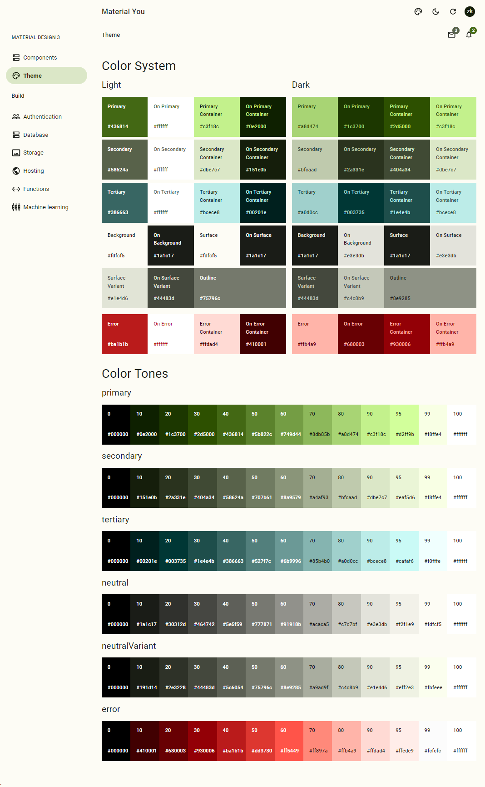

# MUI Material You
Aplicacion React y MUI aplicando el esquema de colores de Android Material You

[Demo](https://react-m3-demo.web.app/ "Demo")

## Default Light

## Default Dark

## Color System

### Light

### Dark

## Color System

